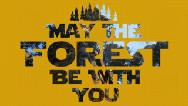

# Become a GEDI Master


## Overview of Course

Join our workshop and become a GEDI Master. The Global Ecosystem Dynamics Investigation (GEDI) is the first full waveform LiDAR instrument on the international space station developed by NASA specifically for measuring forest structure at a global scale. Unlock the huge potential of GEDI in your scientific study. Attendees will learn how to download L2A and L2B data in your own area of interest while becoming familiar with the GEDI data structure. Then we will extract metrics of elevation, height, canopy cover, plant area index, and many more! Finally, you will learn how to use GEDI L4A footprint biomass to estimate biomass in your study area and begin the process of creating wall-to-wall biomass maps using machine learning. By the end of training you will surely become a GEDI master.

-   **An Introduction to the GEDI Mission**

    -   Downloading Materials, Installing Packages

    -   Q&A

-   **Introduction to GEDI Data Downloads**

    -   Using Earth Explorer (login and test AOI)

    -   Downloading over your AOI

-   **GEDI Data Format**

    -   Footprint data

    -   Gridded GEDI Products

    -   Data Dictionaries

-   [**GEDI L2A - Relative Height Metrics**](tutorials/L2A.md)

    -   Open L2A

    -   Extract Metrics

    -   QAQC

    -   Applications

-   [**GEDI L2B - Foliage Metrics and Profiles**](tutorials/L2B.md)

    -   Open L2B

    -   Extract Metrics

    -   QAQC

    -   Applications

-   GEDI L4A - AGB Footprint Data

    -   Open L4A

    -   How to best use L4A?

    -   Considerations for Improvements

-   Developing AGB Maps with GEDI

    -   GEDI L4B 1 km Gridded AGB Data

    -   Considering how to use GEDI to train your own AGB map

    -   Parametric or Machine Learning?

## Initial Installs and Setup

You will need to download (or update) / install / register a couple of things to make sure we are able to move through the workshop seamlessly:

-   Newest version of [R and R studio](https://posit.co/download/rstudio-desktop/)

-   [QGIS](https://www.qgis.org/en/site/forusers/download.html)

-   An account on NASA\'s [EarthData](https://search.earthdata.nasa.gov/)

Once you\'ve installed all of the above please install a small set of R packages using the following command:

``` r
install.packages(c("rgeos",
                 "rgdal",
                 "sf",
                 "rhdf5",
                 "randomForest",
                 "leaps",
                 "raster",
                 "data.table",
                 "ggplot2"))
```

With those things completed you will be ready for the workshop!

{width="383"}
