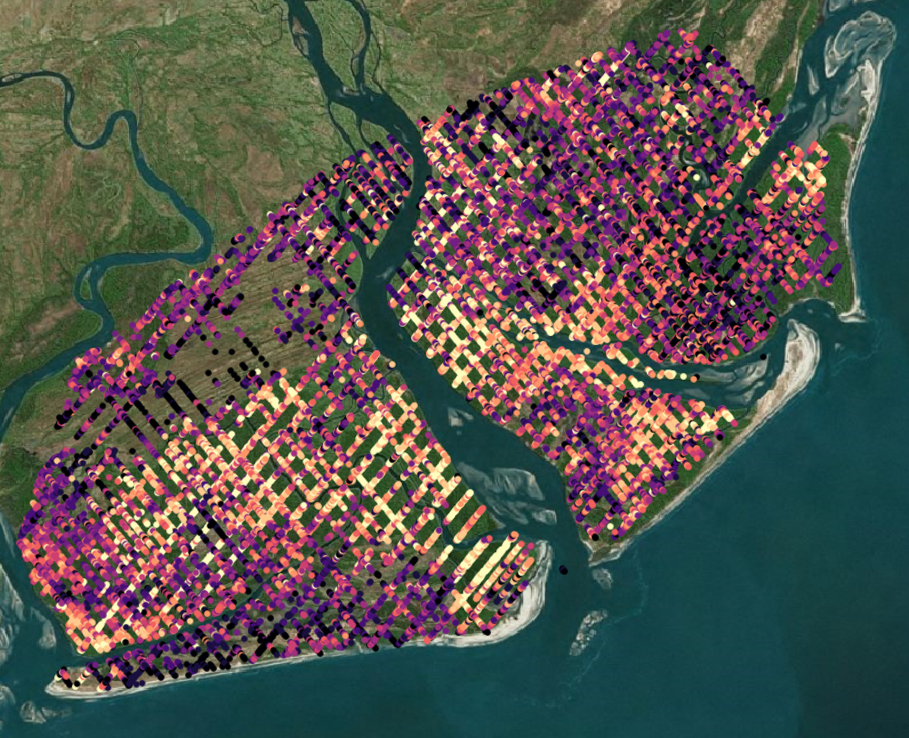
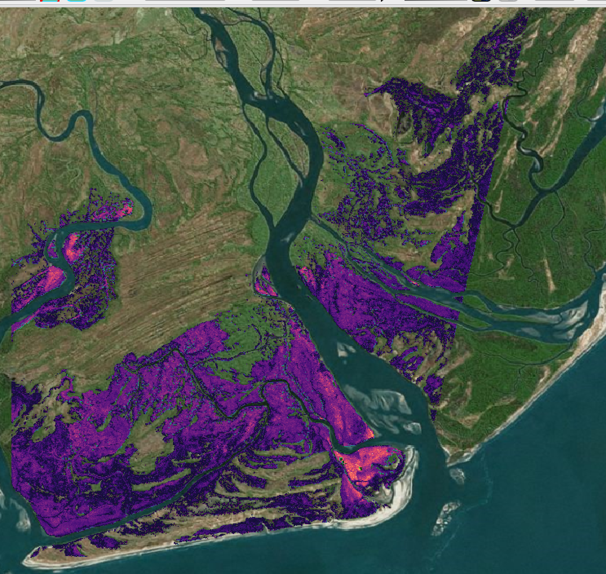

# Developing AGB Maps with GEDI

## The 1 km GEDI AGB product

GEDI has a global AGB product at 1 km resolution (see L4A Tutorial):


Here we can see a portion of the global 1 km GEDI AGB product. At a global scale this product is unprecedented, providing more forest structure measurements and AGB estimates than any other instrument. Whenever we are working with global products we can always make improvements by calibrating to our local study area. For this tutorial we will be using the L4A AGBD estimates to create an improved biomass map at our study site.

## Use L4A as Training Data

The previous tutorials provide all information on preparing L4A data. Here we are going to use these data. Let's import our spatial data:

``` r
#import the L4A AGB data
L4A.q1.sp<-rgdal::readOGR("output/GEDI_L4A_high_quality.shp")
```

Again, we can take a look at our data in QGIS.



With this we can see the distribution of values for aboveground biomass density (AGBD).

## Considering Auxiliary Variables for AGB Predictions

For this tutorial we have a number of auxiliary variables as options to upscale the footprint GEDI predictions. We can use anything from optical data to canopy height models, the list of data included in the tutorial include:

-   ALOS PALSAR - SAR (L-Band)
-   GLAD Global Canopy Height Product (Landsat)
-   Sentinel 1 SAR (dual pole)
-   SRTM Forest Height (mangrove canopy height)
-   TanDEM-X Interferometric SAR (12 m and 90 m)
-   VHR (Very High Resolution) Stereo Imagery
-   ALS Canopy Height Model

All of these products are useful for estimating AGBD over our study site. Key considerations you need to take into account for selecting appropriate ancillary datasets include: spatial resolution, temporal resolution, sensitivity to AGB, technology. In 2021, Stovall et. al. conducted a massive comparison of height and AGB models in Pongara National Park, Gabon. They gleaned a lot about the 18 different height and biomass products that can guide selection of remote sensing in the future appropriate to different ecosystems. Here is an overview of the total biomass and uncertainty for all AGB products compared in this study:


For this tutorial we will be using TanDEM-X product used in this study. Here's a look at that dataset:


# Model AGB with TanDEM-X and GEDI

The process begins by linking the TanDEM-X data to the GEDI L4A AGBD estimates. Here, we repeat the same extraction process shown in the other tutorials. First we need to read in the TanDEM-X data:

``` r
tdx<-raster("Data/Aux/TDX/Zambezi_TDX_CHM.tiff")
```

Next, we extract the height estimates from the TanDEM-X data at the same size as the GEDI footprint (\~25 m diameter):

``` r
tdx.ex<-extract(tdx, L4A.q1.sp, buffer = 25/2/111139, fun='mean',
                     na.rm=T) # 25/2 m radius of GEDI footprint / ~111,139 m per degree of lat/lon 
L4A.q1.sp$tdx<-tdx.ex
```

Now we can plot the relationship between TanDEM-X and GEDI AGB, but let's break it down by the algorithm used for making the AGB estimates (this is important!):


Algorithm 2 appears to perform best (least noise and most number of observations), so let's build our AGB predictions based on this algorithm.

To get a clean relationship lets remove the noise points by simply clipping the TDX data to \~250 Mg ha-1. We also make sure all of the NA values are gone and we've only selected algorithm 2 for our AGB model.

``` raku
#let's create our model subset so we can make an AGB model
L4A.q1.sub<-L4A.q1.sp@data[L4A.q1.sp@data$agbd<=250&
                            L4A.q1.sp@data$agbd>0&
                             !is.na(L4A.q1.sp@data$agbd)&
                             !is.na(L4A.q1.sp@data$tdx)&
                            L4A.q1.sp@data$selected_algorithm==2,]
```

We can develop a non-linear model with this dataset using the `nls` function. Based on the shape of the relationship we are going to use a 3 parameter non-linear model form:

``` r
#fit a non-linear model
nls.m<-nls(agbd~a*tdx^b+c, start=list(a=0.1,b=1, c=50), L4A.q1.sub)
summary(nls.m)
```

Now, let's check how the model fits our data and get some stats:

``` r
Formula: agbd ~ a * tdx^b + c

Parameters:
  Estimate Std. Error t value Pr(>|t|)    
a  0.41137    0.06840   6.014    2e-09 ***
b  1.71344    0.05354  32.000   <2e-16 ***
c 24.23921    0.80641  30.058   <2e-16 ***
---
Signif. codes:  0 ‘***’ 0.001 ‘**’ 0.01 ‘*’ 0.05 ‘.’ 0.1 ‘ ’ 1

Residual standard error: 22.87 on 3394 degrees of freedom

Number of iterations to convergence: 7 
Achieved convergence tolerance: 1.381e-06
```

How does the model fit our data? Let's take a look:

``` r
#does a height metric look non-linear?
plot(L4A.q1.sub$tdx, L4A.q1.sub$agbd)

#look at the model
lines(0:35,predict(nls.m, newdata=data.frame(tdx=0:35)), col="red")
```


Despite the noise in the relationship this is useful and we can apply it to the TanDEM-X data for a wall-to-wall AGB map. Now we can make our predictions across the raster data and take a look:

``` r
 tdx.agb<-coef(nls.m)[1]*tdx^coef(nls.m)[2]+coef(nls.m)[3]
```




Looking good!

## Compare to ALS AGB Model

We developed another AGB map using ALS data over the same area and we can compare our TanDEM-X AGB map to the ALS AGB map. The code for a simple differencing of the two maps is simple, requiring a reprojection and subtraction.

``` r
#import our ALS AGB raster
als.agb<-raster("Data/ALS/agb_map.tif")

#reproject the ALS raster to the same resolution as the TDX data
als.agb.t<-projectRaster(als.agb, tdx.agb, method='ngb')

#remove NA values
tdx.agb[is.na(als.agb.t)]<-NA

#look at the difference!
plot(als.agb.t-tdx.agb)

writeRaster(tdx.agb-als.agb.t, "output/agb_als_tdx_diff.tif")
```

Now we can open this in QGIS and use a divergent color scale to see how they compare:


Based on this, the GEDI, based model underestimates biomass across the study area, which is common in many systems where AGB models have not been locally calibrated. How might we correct this? A simple bias correction between the two maps will solve some of this.

``` r
# we first stack the two rasters and extract the points into a dataframe
agb.s.df<-as.data.frame(rasterToPoints(stack(als.agb.t,tdx.agb)))

#rename the columns
colnames(agb.s.df)[3:4]<-c("als","tdx")

# exclude the NA values!
agb.s.df<-na.exclude(agb.s.df)

#fit a simple linear model for a bias correction 
m<-lm(als~tdx, agb.s.df)

#what do the model parameters look like?
summary(m)
```

``` r
Call:
lm(formula = als ~ tdx, data = agb.s.df)

Residuals:
   Min     1Q Median     3Q    Max 
-534.9  -22.1   -1.7   19.7 7292.4 

Coefficients:
             Estimate Std. Error t value Pr(>|t|)    
(Intercept) 2.695e+01  2.592e-02    1040   <2e-16 ***
tdx         2.021e+00  3.882e-04    5205   <2e-16 ***
---
Signif. codes:  0 ‘***’ 0.001 ‘**’ 0.01 ‘*’ 0.05 ‘.’ 0.1 ‘ ’ 1

Residual standard error: 43.16 on 15886454 degrees of freedom
Multiple R-squared:  0.6304,    Adjusted R-squared:  0.6304 
F-statistic: 2.71e+07 on 1 and 15886454 DF,  p-value: < 2.2e-16
```

Now we can apply these coefficients to our predicted and mapped AGB values for an unbiased AGB prediction:

**Without Bias Correction**

``` r
ggplot(agb.s.df[2.695e+01+agb.s.df$tdx*2.021>=90, ], aes(als,tdx))+
  geom_hex(bins=250, color=NA)+
  coord_fixed(xlim=c(0,300),ylim=c(0,300))+
  geom_abline(intercept = 0, slope=1, color="blue")+
  scale_fill_viridis(option='magma')+
  scale_color_viridis(option='magma')+
  theme(panel.background = element_rect(fill="black"),
        panel.grid = element_blank())
```


**With Bias Correction**

``` r
ggplot(agb.s.df[2.695e+01+agb.s.df$tdx*2.021>=90, ], 
       aes(als,(2.695e+01+tdx*2.021)))+
  geom_hex(bins=250, color=NA)+
  coord_fixed(xlim=c(0,300),ylim=c(0,300))+
  geom_abline(intercept = 0, slope=1, color="blue")+
  scale_fill_viridis(option='magma')+
  scale_color_viridis(option='magma')+
  theme(panel.background = element_rect(fill="black"),
        panel.grid = element_blank())
```


**Bias Corrected AGB map difference from ALS AGB map**


## Machine Learning for AGB Models?

In general, physical variables that we know to be directly related to AGB are best when using parametric models. In this example, we used forest height estimates and GEDI footprint biomass to model AGB across the whole study area, but other less direct structural metrics could also be used. This is the general approach to using suites of optical metrics from sensors like Landsat. In these cases we can rely on machine learning to predict AGB from metrics that are more ambiguous. The following example code shows how - in a basic sense - we use machine learning like RandomForest to predict AGB over an area using multiple metrics. Note: the following code was developed using ALS data and the suite of metrics derived from this data source, but the same basic approach applies to any suite of metrics to predict AGB over an area:

``` r
library(randomForest)

#we can also use random forest - not always ideal
rf.m<-randomForest(AGB~., do.trace=TRUE,data=metrics_all.m[,-c(1,7, 59:60)],
                   ntree=1000)
plot(rf.m)

#which variables are important?
names(importance(rf.m)[rev(order(importance(rf.m))),])[1:10]

#plot the variable importance
randomForest::varImpPlot(rf.m)

# create a model from the best subset of variables
rf.m<-randomForest(AGB~zq90+zmax+zq55, do.trace=TRUE,data=metrics_all.m)

#check the absolute and relative RMSE
sqrt(mean((predict(rf.m)-metrics_all.m$AGB)^2))/mean(metrics_all.m$AGB)
sqrt(mean((predict(rf.m)-metrics_all.m$AGB)^2))

#look at the one to one plot!
plot(predict(rf.m), metrics_all.m$AGB)
abline(0,1)
```
