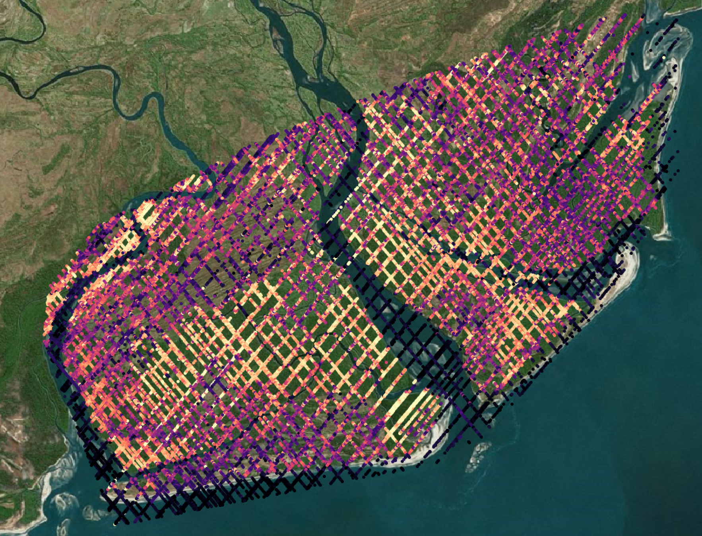
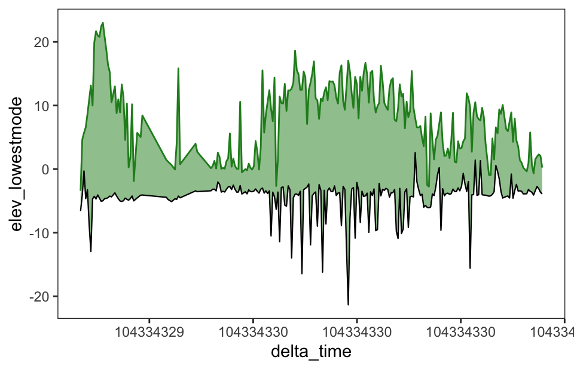
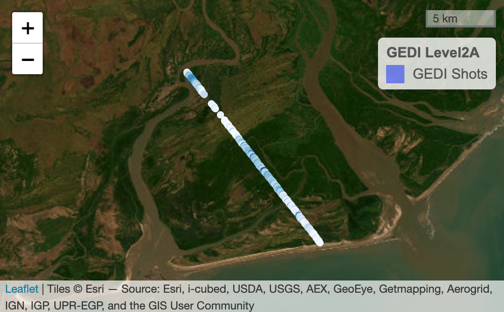
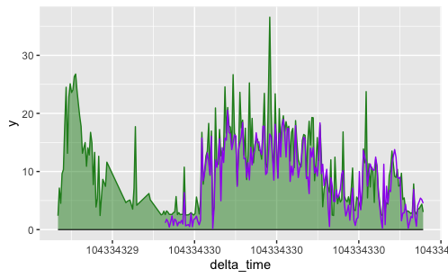
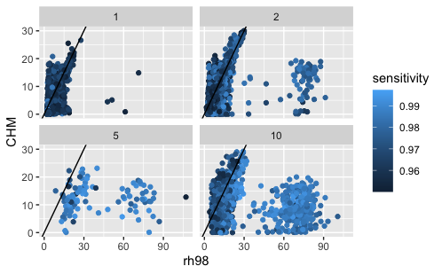
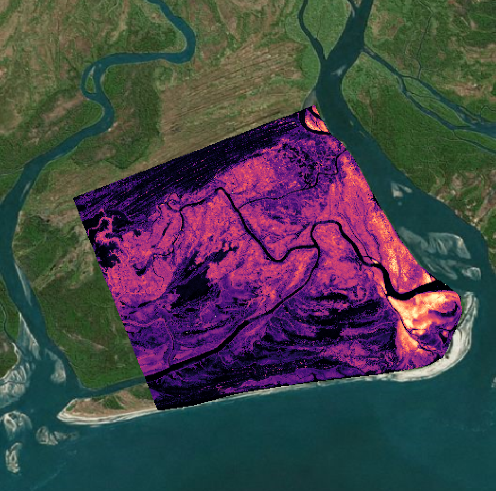
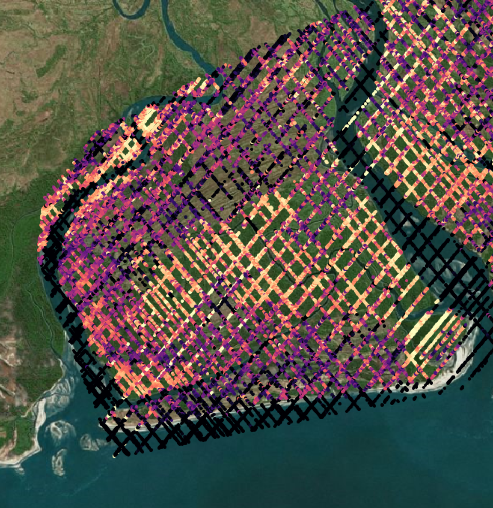

# GEDI L2A

## Load Packages and Functions

``` r
library(hdf5r)
library(data.table)
library(raster)
library(ggplot2)
library(rgdal)
source("R/GEDI_FUN.R")
```

## Get your list of GEDI L2A Data

``` r
#get a list of GEDI L2A files
L2A.ls<-list.files("Data/GEDIL2A", recursive = TRUE, full.names = TRUE)
```

## GEDI data structure

First, let's take a look

``` r
print(L2A.ls[1:4])
```

```         
[1] "Data/GEDIL2A/59924/2432379244/processed_GEDI02_A_2019116121457_O02091_04_T00476_02_003_01_V002.h5"
[2] "Data/GEDIL2A/59924/2432394135/processed_GEDI02_A_2019123093221_O02198_04_T03016_02_003_01_V002.h5"
[3] "Data/GEDIL2A/59924/2432532074/processed_GEDI02_A_2019158192850_O02748_04_T01746_02_003_01_V002.h5"
[4] "Data/GEDIL2A/59924/2432560840/processed_GEDI02_A_2019174002232_O02984_01_T02212_02_003_01_V002.h5"
```

For an example of the GEDI data structure I'm going to choose a single
orbit within our AOI:

``` r
#Pick one!
gedi.file<-L2A.ls[1]

#read in the GEDI L2A file
L2A.h5<-readLevel2A(gedi.file)
```

`readLevel2A` simply reads in the h5 GEDI file. Nothing mysterious!

Now that we have a GEDI file in R we need to look at the stucture. It
has a very complex hierarchical structure:

``` r
#Let's look at a subset of the GEDI data structure
list.datasets(L2A.h5)[1:180]
```

```         
##   [1] "/BEAM0000/algorithmrun_flag"                       
##   [2] "/BEAM0000/ancillary/dz"                            
##   [3] "/BEAM0000/ancillary/l2a_alg_count"                 
##   [4] "/BEAM0000/ancillary/maxheight_cuttoff"             
##   [5] "/BEAM0000/ancillary/rg_eg_constraint_center_buffer"
##   [6] "/BEAM0000/ancillary/rg_eg_mpfit_max_func_evals"    
##   [7] "/BEAM0000/ancillary/rg_eg_mpfit_maxiters"          
##   [8] "/BEAM0000/ancillary/rg_eg_mpfit_tolerance"         
##   [9] "/BEAM0000/ancillary/signal_search_buff"            
##  [10] "/BEAM0000/ancillary/tx_noise_stddev_multiplier"    
##  [11] "/BEAM0000/beam"                                    
##  [12] "/BEAM0000/channel"                                 
##  [13] "/BEAM0000/cover"                                   
##  [14] "/BEAM0000/cover_z"                                 
##  [15] "/BEAM0000/delta_time"                              
##  [16] "/BEAM0000/fhd_normal"                              
##  [17] "/BEAM0000/geolocation/degrade_flag"                
##  [18] "/BEAM0000/geolocation/delta_time"                  
##  [19] "/BEAM0000/geolocation/digital_elevation_model"     
##  [20] "/BEAM0000/geolocation/elev_highestreturn"          
##  [21] "/BEAM0000/geolocation/elev_lowestmode"             
##  [22] "/BEAM0000/geolocation/elevation_bin0"              
##  [23] "/BEAM0000/geolocation/elevation_bin0_error"        
##  [24] "/BEAM0000/geolocation/elevation_lastbin"           
##  [25] "/BEAM0000/geolocation/elevation_lastbin_error"     
##  [26] "/BEAM0000/geolocation/height_bin0"                 
##  [27] "/BEAM0000/geolocation/height_lastbin"              
##  [28] "/BEAM0000/geolocation/lat_highestreturn"           
##  [29] "/BEAM0000/geolocation/lat_lowestmode"              
##  [30] "/BEAM0000/geolocation/latitude_bin0"               
##  [31] "/BEAM0000/geolocation/latitude_bin0_error"         
##  [32] "/BEAM0000/geolocation/latitude_lastbin"            
##  [33] "/BEAM0000/geolocation/latitude_lastbin_error"      
##  [34] "/BEAM0000/geolocation/local_beam_azimuth"          
##  [35] "/BEAM0000/geolocation/local_beam_elevation"        
##  [36] "/BEAM0000/geolocation/lon_highestreturn"           
##  [37] "/BEAM0000/geolocation/lon_lowestmode"              
##  [38] "/BEAM0000/geolocation/longitude_bin0"              
##  [39] "/BEAM0000/geolocation/longitude_bin0_error"        
##  [40] "/BEAM0000/geolocation/longitude_lastbin"           
##  [41] "/BEAM0000/geolocation/longitude_lastbin_error"     
##  [42] "/BEAM0000/geolocation/shot_number"                 
##  [43] "/BEAM0000/geolocation/solar_azimuth"               
##  [44] "/BEAM0000/geolocation/solar_elevation"             
##  [45] "/BEAM0000/l2a_quality_flag"                        
##  [46] "/BEAM0000/l2b_quality_flag"                        
##  [47] "/BEAM0000/land_cover_data/landsat_treecover"       
##  [48] "/BEAM0000/land_cover_data/modis_nonvegetated"      
##  [49] "/BEAM0000/land_cover_data/modis_nonvegetated_sd"   
##  [50] "/BEAM0000/land_cover_data/modis_treecover"         
##  [51] "/BEAM0000/land_cover_data/modis_treecover_sd"      
##  [52] "/BEAM0000/master_frac"                             
##  [53] "/BEAM0000/master_int"                              
##  [54] "/BEAM0000/num_detectedmodes"                       
##  [55] "/BEAM0000/omega"                                   
##  [56] "/BEAM0000/pai"                                     
##  [57] "/BEAM0000/pai_z"                                   
##  [58] "/BEAM0000/pavd_z"                                  
##  [59] "/BEAM0000/pgap_theta"                              
##  [60] "/BEAM0000/pgap_theta_error"                        
##  [61] "/BEAM0000/pgap_theta_z"                            
##  [62] "/BEAM0000/rg"                                      
##  [63] "/BEAM0000/rh100"                                   
##  [64] "/BEAM0000/rhog"                                    
##  [65] "/BEAM0000/rhog_error"                              
##  [66] "/BEAM0000/rhov"                                    
##  [67] "/BEAM0000/rhov_error"                              
##  [68] "/BEAM0000/rossg"                                   
##  [69] "/BEAM0000/rv"                                      
##  [70] "/BEAM0000/rx_processing/algorithmrun_flag_a1"      
##  [71] "/BEAM0000/rx_processing/algorithmrun_flag_a2"      
##  [72] "/BEAM0000/rx_processing/algorithmrun_flag_a3"      
##  [73] "/BEAM0000/rx_processing/algorithmrun_flag_a4"      
##  [74] "/BEAM0000/rx_processing/algorithmrun_flag_a5"      
##  [75] "/BEAM0000/rx_processing/algorithmrun_flag_a6"      
##  [76] "/BEAM0000/rx_processing/pgap_theta_a1"             
##  [77] "/BEAM0000/rx_processing/pgap_theta_a2"             
##  [78] "/BEAM0000/rx_processing/pgap_theta_a3"             
##  [79] "/BEAM0000/rx_processing/pgap_theta_a4"             
##  [80] "/BEAM0000/rx_processing/pgap_theta_a5"             
##  [81] "/BEAM0000/rx_processing/pgap_theta_a6"             
##  [82] "/BEAM0000/rx_processing/pgap_theta_error_a1"       
##  [83] "/BEAM0000/rx_processing/pgap_theta_error_a2"       
##  [84] "/BEAM0000/rx_processing/pgap_theta_error_a3"       
##  [85] "/BEAM0000/rx_processing/pgap_theta_error_a4"       
##  [86] "/BEAM0000/rx_processing/pgap_theta_error_a5"       
##  [87] "/BEAM0000/rx_processing/pgap_theta_error_a6"       
##  [88] "/BEAM0000/rx_processing/rg_a1"                     
##  [89] "/BEAM0000/rx_processing/rg_a2"                     
##  [90] "/BEAM0000/rx_processing/rg_a3"                     
##  [91] "/BEAM0000/rx_processing/rg_a4"                     
##  [92] "/BEAM0000/rx_processing/rg_a5"                     
##  [93] "/BEAM0000/rx_processing/rg_a6"                     
##  [94] "/BEAM0000/rx_processing/rg_eg_amplitude_a1"        
##  [95] "/BEAM0000/rx_processing/rg_eg_amplitude_a2"        
##  [96] "/BEAM0000/rx_processing/rg_eg_amplitude_a3"        
##  [97] "/BEAM0000/rx_processing/rg_eg_amplitude_a4"        
##  [98] "/BEAM0000/rx_processing/rg_eg_amplitude_a5"        
##  [99] "/BEAM0000/rx_processing/rg_eg_amplitude_a6"        
## [100] "/BEAM0000/rx_processing/rg_eg_amplitude_error_a1"  
## [101] "/BEAM0000/rx_processing/rg_eg_amplitude_error_a2"  
## [102] "/BEAM0000/rx_processing/rg_eg_amplitude_error_a3"  
## [103] "/BEAM0000/rx_processing/rg_eg_amplitude_error_a4"  
## [104] "/BEAM0000/rx_processing/rg_eg_amplitude_error_a5"  
## [105] "/BEAM0000/rx_processing/rg_eg_amplitude_error_a6"  
## [106] "/BEAM0000/rx_processing/rg_eg_center_a1"           
## [107] "/BEAM0000/rx_processing/rg_eg_center_a2"           
## [108] "/BEAM0000/rx_processing/rg_eg_center_a3"           
## [109] "/BEAM0000/rx_processing/rg_eg_center_a4"           
## [110] "/BEAM0000/rx_processing/rg_eg_center_a5"           
## [111] "/BEAM0000/rx_processing/rg_eg_center_a6"           
## [112] "/BEAM0000/rx_processing/rg_eg_center_error_a1"     
## [113] "/BEAM0000/rx_processing/rg_eg_center_error_a2"     
## [114] "/BEAM0000/rx_processing/rg_eg_center_error_a3"     
## [115] "/BEAM0000/rx_processing/rg_eg_center_error_a4"     
## [116] "/BEAM0000/rx_processing/rg_eg_center_error_a5"     
## [117] "/BEAM0000/rx_processing/rg_eg_center_error_a6"     
## [118] "/BEAM0000/rx_processing/rg_eg_chisq_a1"            
## [119] "/BEAM0000/rx_processing/rg_eg_chisq_a2"            
## [120] "/BEAM0000/rx_processing/rg_eg_chisq_a3"            
## [121] "/BEAM0000/rx_processing/rg_eg_chisq_a4"            
## [122] "/BEAM0000/rx_processing/rg_eg_chisq_a5"            
## [123] "/BEAM0000/rx_processing/rg_eg_chisq_a6"            
## [124] "/BEAM0000/rx_processing/rg_eg_flag_a1"             
## [125] "/BEAM0000/rx_processing/rg_eg_flag_a2"             
## [126] "/BEAM0000/rx_processing/rg_eg_flag_a3"             
## [127] "/BEAM0000/rx_processing/rg_eg_flag_a4"             
## [128] "/BEAM0000/rx_processing/rg_eg_flag_a5"             
## [129] "/BEAM0000/rx_processing/rg_eg_flag_a6"             
## [130] "/BEAM0000/rx_processing/rg_eg_gamma_a1"            
## [131] "/BEAM0000/rx_processing/rg_eg_gamma_a2"            
## [132] "/BEAM0000/rx_processing/rg_eg_gamma_a3"            
## [133] "/BEAM0000/rx_processing/rg_eg_gamma_a4"            
## [134] "/BEAM0000/rx_processing/rg_eg_gamma_a5"            
## [135] "/BEAM0000/rx_processing/rg_eg_gamma_a6"            
## [136] "/BEAM0000/rx_processing/rg_eg_gamma_error_a1"      
## [137] "/BEAM0000/rx_processing/rg_eg_gamma_error_a2"      
## [138] "/BEAM0000/rx_processing/rg_eg_gamma_error_a3"      
## [139] "/BEAM0000/rx_processing/rg_eg_gamma_error_a4"      
## [140] "/BEAM0000/rx_processing/rg_eg_gamma_error_a5"      
## [141] "/BEAM0000/rx_processing/rg_eg_gamma_error_a6"      
## [142] "/BEAM0000/rx_processing/rg_eg_niter_a1"            
## [143] "/BEAM0000/rx_processing/rg_eg_niter_a2"            
## [144] "/BEAM0000/rx_processing/rg_eg_niter_a3"            
## [145] "/BEAM0000/rx_processing/rg_eg_niter_a4"            
## [146] "/BEAM0000/rx_processing/rg_eg_niter_a5"            
## [147] "/BEAM0000/rx_processing/rg_eg_niter_a6"            
## [148] "/BEAM0000/rx_processing/rg_eg_sigma_a1"            
## [149] "/BEAM0000/rx_processing/rg_eg_sigma_a2"            
## [150] "/BEAM0000/rx_processing/rg_eg_sigma_a3"            
## [151] "/BEAM0000/rx_processing/rg_eg_sigma_a4"            
## [152] "/BEAM0000/rx_processing/rg_eg_sigma_a5"            
## [153] "/BEAM0000/rx_processing/rg_eg_sigma_a6"            
## [154] "/BEAM0000/rx_processing/rg_eg_sigma_error_a1"      
## [155] "/BEAM0000/rx_processing/rg_eg_sigma_error_a2"      
## [156] "/BEAM0000/rx_processing/rg_eg_sigma_error_a3"      
## [157] "/BEAM0000/rx_processing/rg_eg_sigma_error_a4"      
## [158] "/BEAM0000/rx_processing/rg_eg_sigma_error_a5"      
## [159] "/BEAM0000/rx_processing/rg_eg_sigma_error_a6"      
## [160] "/BEAM0000/rx_processing/rg_error_a1"               
## [161] "/BEAM0000/rx_processing/rg_error_a2"               
## [162] "/BEAM0000/rx_processing/rg_error_a3"               
## [163] "/BEAM0000/rx_processing/rg_error_a4"               
## [164] "/BEAM0000/rx_processing/rg_error_a5"               
## [165] "/BEAM0000/rx_processing/rg_error_a6"               
## [166] "/BEAM0000/rx_processing/rv_a1"                     
## [167] "/BEAM0000/rx_processing/rv_a2"                     
## [168] "/BEAM0000/rx_processing/rv_a3"                     
## [169] "/BEAM0000/rx_processing/rv_a4"                     
## [170] "/BEAM0000/rx_processing/rv_a5"                     
## [171] "/BEAM0000/rx_processing/rv_a6"                     
## [172] "/BEAM0000/rx_processing/rx_energy_a1"              
## [173] "/BEAM0000/rx_processing/rx_energy_a2"              
## [174] "/BEAM0000/rx_processing/rx_energy_a3"              
## [175] "/BEAM0000/rx_processing/rx_energy_a4"              
## [176] "/BEAM0000/rx_processing/rx_energy_a5"              
## [177] "/BEAM0000/rx_processing/rx_energy_a6"              
## [178] "/BEAM0000/rx_processing/shot_number"               
## [179] "/BEAM0000/rx_range_highestreturn"                  
## [180] "/BEAM0000/rx_sample_count"
```

**WOW!** That is a lot of info to grab (548 categories X 8 beams!). So
you need to choose what is important to you for processing.

Now, within each beam we can subset by the specific data we need.

# Read in ALL of our GEDI data

## A simple lapply function

Ideally we want to do all of this automatically for lots of GEDI data,
so we can use this simple function:

``` r
#now we can read all GEDI files into a list and combine

#we use a lapply function to do this as it can easily be made parallel
L2A.ls.all<-lapply(L2A.ls, function(x){
  L2A.m<-NULL
  L2A.h5<-readLevel2A(x)
  try(L2A.m<-getLevel2A(L2A.h5), silent = TRUE)
  return(L2A.m)
})
```

`readLevel2B` imports the GEDI h5 files, then `getLevel2BVPM` selects
useful metrics for further processing. This greatly simplifies the
pipeline. We can modify this function to include specific information
from the h5 file, but for now it includes:

"beam" "shot_number" "degrade_flag" "quality_flag" "delta_time"
"sensitivity" "solar_elevation" "lat_lowestmode" "lon_lowestmode"
"elev_highestreturn" "elev_lowestmode" "selected_algorithm" and **RH
metrics from 0 to 100 at 1 m intervals**

I find these variables give me most of what I need from the L2A data
product.

## Process using lapply

Now we can use `lapply` to process our list of GEDI L2A data

``` r
#we use a lapply function to do this as it can easily be made parallel
L2A.ls.all<-lapply(L2A.ls, function(x){
  L2A.m<-NULL
  L2A.h5<-readLevel2A(x)
  try(L2A.m<-getLevel2A(L2A.h5), silent = TRUE)
  return(L2A.m)
})

#combine the list into a single long data frame with the rbind command
L2A.all<-do.call(rbind,L2A.ls.all)
```

We can now take a look at all of our GEDI data, but first lets...

## Process in parallel

We can preferably use the `parallel` package to process everything with
lightning speeds!

``` r
library(parallel)
# Calculate the number of cores
no_cores <- detectCores() - 1

# Initiate cluster
cl <- makeCluster(no_cores)

L2A.ls.all<-
  parLapply(cl, L2A.ls, function(x){
  
  library(hdf5r)
  library(data.table)
  library(raster)
  
  source("R/GEDI_FUN.R")
  
  L2A.m<-NULL
  try(L2A.h5<-readLevel2A(x), silent = TRUE)
  try(L2A.m<-getLevel2A(L2A.h5), silent = TRUE)
  return(L2A.m)
})
stopCluster(cl)

#combine the list into a single long data frame with the rbind command
L2A.all<-do.call(rbind,L2A.ls.all)
```

We can now (really!) start working with our GEDI data.

## Clipping to our AOI

We will now import our polygon extent, extract data within our AOI, and
write to file:

``` r
#Make a spatial object from the DF for subsetting and extraction. Don't forget the CRS!
L2A.sp<-SpatialPointsDataFrame(coords=cbind(L2A.all$lon_lowestmode,L2A.all$lat_lowestmode),
                               data=L2A.all,
                               proj4string = crs(raster()))
#we bring in our extent polygon and use it for subsetting.
extent.poly<-rgdal::readOGR("Data/extent/Zambezi_poly.shp")

#Why do we use extract? The clip function will not accept geometry, 
# so the square extent is the only thing it will clip to. If you want to use 
# complex geometry, use this method.
ext.ex<-extract(extent.poly, L2A.sp)

#add extracted values to the GEDI data
L2A.sp@data$ext.flag<-ext.ex[,2]

#now subset by the identified extent flag
L2A.sp<-L2A.sp[!is.na(L2A.sp$ext.flag),]

#we also need to convert the shot number column to an integer for writing purposes
L2A.sp$shot_number<-as.numeric(L2A.sp$shot_number)

#write the file!
writeOGR(L2A.sp, "GEDI_L2A.shp", layer='shot_number', driver="ESRI Shapefile")
```

Let's take a look at these data in QGIS (colored by degrade flag):


All black values are potentially poor quality, so let's filter by the
quality flags and see what we get.

``` r
#now let's subset based on our observations
L2A.q1.sp<-L2A.sp[L2A.sp$degrade_flag==0&
                    L2A.sp$quality_flag==1,]

#write the file!
writeOGR(L2A.q1.sp, "GEDI_L2A_high_quality.shp", layer='shot_number', driver="ESRI Shapefile")
```



With this we can see the distribution of values for each variable. Now
we can visualize some GEDI transects.

## Viewing a transect of GEDI L2A data

Let's take a look at a subset of data with the profiles based on ground
elevation and canopy height:

``` r
gedi.sub<-L2A.q1.sp@data[L2A.q1.sp@data$delta_time <= (104334330.891843348741531) &
                           L2A.q1.sp@data$delta_time >= (104334330.891843348741531-100) &
                           L2A.q1.sp@data$beam == "BEAM0101",]
library(ggplot2)
ggplot(gedi.sub,
       aes(x=delta_time,y=elev_lowestmode))+
  geom_ribbon(aes(ymin=elev_lowestmode,ymax=rh100+elev_lowestmode),
              fill="forestgreen", alpha=0.5)+
  geom_path(aes(y=rh100+elev_lowestmode), color="forestgreen")+
  geom_path(color="black", linewidth=0.4)+
  theme_bw()+theme(panel.grid = element_blank())
```



Where are we??? Let's look in a map:

``` r
library(leaflet)
pal <- colorNumeric(
  palette = "Blues",
  domain = gedi.sub$rh100)

m1<-leaflet() %>%
  addCircleMarkers(gedi.sub$lon_lowestmode,
                   gedi.sub$lat_lowestmode,
                   radius = 1,
                   opacity = 1,
                   color = pal(gedi.sub$rh100))  %>%
  addScaleBar(options = list(imperial = FALSE)) %>%
  addProviderTiles(providers$Esri.WorldImagery)  %>%
  addLegend(colors = "blue", labels= c("GEDI Shots"),
            title ="GEDI Level2A") 
m1
```



# Comparing to ALS data

## Viewing a transect of GEDI L2A data vs a CHM

Now we will import a canopy height model developed from ALS data and see
how well GEDI performs:

``` r
#Let's compare to another 7 m resolution canopy height product from ALS
CHM.dd<-raster("Data/ALS/CHM_dd.tif")
chm.ex<-raster::extract(CHM.dd, 
                        L2A.q1.sp,
                        buffer = 25/2/111139, fun='mean')
#add extracted values to the GEDI data
L2A.q1.sp$CHM<-chm.ex
```

If we subset to the same profile we've already viewed we can compare the
GEDI rh98 to the ALS canopy heights:

``` r
gedi.sub<-L2A.q1.sp@data[L2A.q1.sp@data$delta_time <= (104334330.891843348741531) &
                           L2A.q1.sp@data$delta_time >= (104334330.891843348741531-10) &
                           L2A.q1.sp@data$beam == "BEAM0101", ]

library(ggplot2)
ggplot(gedi.sub,
       aes(x=delta_time,y=0))+
  geom_ribbon(aes(ymin=0,ymax=rh98),
              fill="forestgreen", alpha=0.5)+
  geom_path(aes(y=rh98), color="forestgreen")+
  geom_path(color="black", linewidth=0.4)+
  geom_path(aes(y=CHM),color="purple")
  theme_bw()+theme(panel.grid = element_blank())
```



Not bad, especially since the ALS was collected in 2013 and GEDI was
collected almost a decade later!

## Performing a Validation of GEDI RH98 heights with ALS

First, what factors affect GEDI a LOT - canopy cover, beam sensitivity,
and ground finding. Here we will look at only "high quality shots" and
determine which ground finding algorithm is best:

``` r
L2A.all.sub<-L2A.q1.sp[!is.na(L2A.q1.sp$CHM)&
                         L2A.q1.sp$quality_flag==1&
                         L2A.q1.sp$sensitivity>0.95,]

library(ggplot2)
ggplot(L2A.all.sub@data, aes(rh98, CHM))+
  geom_point(aes(color=sensitivity))+
  facet_wrap(~selected_algorithm)+
  geom_abline(slope=1,intercept=0)
```



Algorithm 1 and 2 seem to perform best. Cool!

## Visual Assessment

Now, if we compare the high quality GEDI shots to the CHM the patterns
are quite representative.

{width="338"}

{width="338"}
