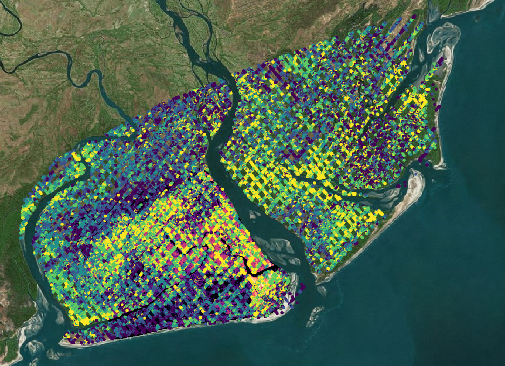
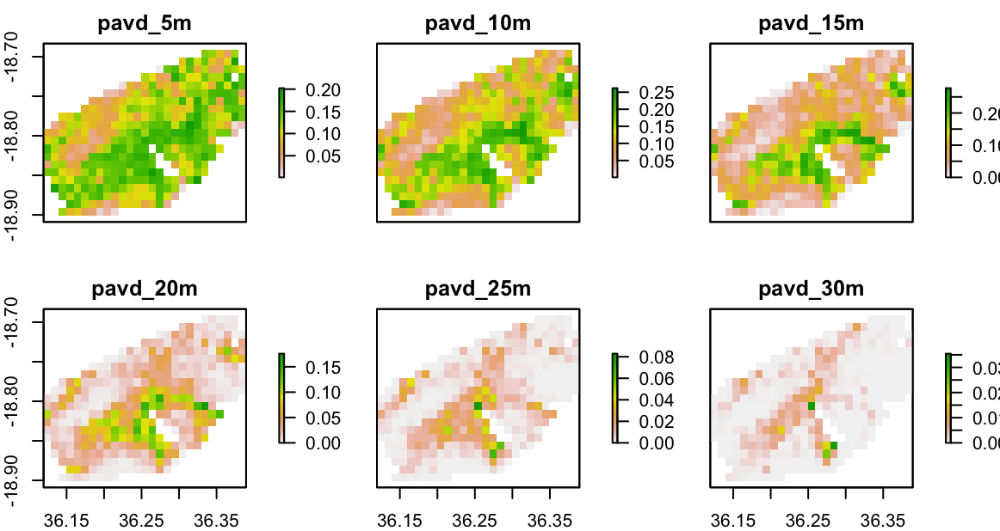
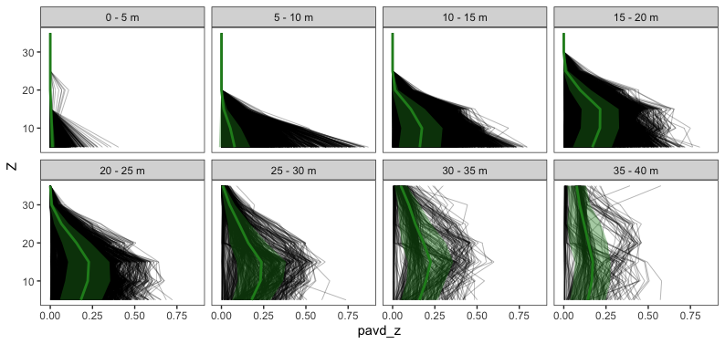

# GEDI L2B

## Load Packages and Functions

``` r
library(hdf5r)
library(data.table)
library(raster)
library(ggplot2)

source("R/GEDI_FUN.R")
```

## Get your list of GEDI L2B Data

``` r
#get a list of GEDI L2B files
L2B.ls<-list.files("Data/GEDIL2B", recursive = TRUE, full.names = TRUE)
```

## GEDI L2B data structure

First, let's take a look

``` r
print(L2B.ls[1:4])
```

```         
[1] "Data/GEDIL2B/59923/2433506044/processed_GEDI02_B_2019123093221_O02198_04_T03016_02_003_01_V002.h5"
[2] "Data/GEDIL2B/59923/2433539959/processed_GEDI02_B_2019158192850_O02748_04_T01746_02_003_01_V002.h5"
[3] "Data/GEDIL2B/59923/2433558399/processed_GEDI02_B_2019174002232_O02984_01_T02212_02_003_01_V002.h5"
[4] "Data/GEDIL2B/59923/2433589633/processed_GEDI02_B_2019116121457_O02091_04_T00476_02_003_01_V002.h5"
```

For an example of the GEDI data structure I'm going to choose a single
orbit within our AOI:

``` r
#Pick one!
gedi.file<-L2B.ls[1]

#read in the GEDI L2B file
L2B.h5<-readLevel2B(gedi.file)
```

`readLevel2B` simply reads in the h5 GEDI file. Nothing mysterious!

Now that we have a GEDI L2B data in R we can look at the structure. It
has a very complex hierarchical structure:

``` r
#Let's look at a subset of the GEDI data structure
list.datasets(L2B.h5[["BEAM0000"]])
```

```         
  [1] "rg"                                        "beam"                                     
  [3] "selected_mode_flag"                        "rhov"                                     
  [5] "selected_l2a_algorithm"                    "selected_rg_algorithm"                    
  [7] "sensitivity"                               "ancillary/maxheight_cuttoff"              
  [9] "ancillary/tx_noise_stddev_multiplier"      "ancillary/dz"                             
 [11] "ancillary/l2a_alg_count"                   "ancillary/rg_eg_mpfit_tolerance"          
 [13] "ancillary/rg_eg_constraint_center_buffer"  "ancillary/signal_search_buff"             
 [15] "ancillary/rg_eg_mpfit_maxiters"            "ancillary/rg_eg_mpfit_max_func_evals"     
 [17] "pgap_theta"                                "cover_z"                                  
 [19] "rx_range_highestreturn"                    "rv"                                       
 [21] "fhd_normal"                                "cover"                                    
 [23] "rhog_error"                                "selected_mode"                            
 [25] "rx_processing/rg_eg_gamma_error_a2"        "rx_processing/rg_eg_gamma_a2"             
 [27] "rx_processing/rg_eg_amplitude_error_a5"    "rx_processing/pgap_theta_error_a4"        
 [29] "rx_processing/rx_energy_a6"                "rx_processing/rg_a2"                      
 [31] "rx_processing/rg_a4"                       "rx_processing/rg_eg_niter_a4"             
 [33] "rx_processing/pgap_theta_a2"               "rx_processing/pgap_theta_a4"              
 [35] "rx_processing/rg_eg_flag_a4"               "rx_processing/rg_error_a3"                
 [37] "rx_processing/rg_eg_amplitude_error_a2"    "rx_processing/rg_eg_gamma_a1"             
 [39] "rx_processing/rg_eg_gamma_error_a6"        "rx_processing/rg_eg_sigma_error_a2"       
 [41] "rx_processing/rg_error_a1"                 "rx_processing/rg_eg_sigma_error_a4"       
 [43] "rx_processing/rg_error_a2"                 "rx_processing/rg_eg_center_a2"            
 [45] "rx_processing/rg_eg_niter_a5"              "rx_processing/rg_eg_amplitude_error_a1"   
 [47] "rx_processing/rg_eg_center_error_a6"       "rx_processing/rg_eg_center_error_a3"      
 [49] "rx_processing/rg_eg_gamma_a3"              "rx_processing/rg_eg_center_a5"            
 [51] "rx_processing/rg_eg_sigma_error_a6"        "rx_processing/rg_eg_niter_a3"             
 [53] "rx_processing/rg_a6"                       "rx_processing/rg_a3"                      
 [55] "rx_processing/rg_eg_flag_a6"               "rx_processing/rg_eg_sigma_a2"             
 [57] "rx_processing/rv_a6"                       "rx_processing/rg_eg_gamma_error_a4"       
 [59] "rx_processing/rg_eg_flag_a1"               "rx_processing/rv_a3"                      
 [61] "rx_processing/pgap_theta_error_a5"         "rx_processing/rg_eg_flag_a3"              
 [63] "rx_processing/rg_eg_amplitude_a3"          "rx_processing/rx_energy_a1"               
 [65] "rx_processing/rg_eg_center_a6"             "rx_processing/rv_a1"                      
 [67] "rx_processing/rg_eg_sigma_a4"              "rx_processing/rg_eg_gamma_a4"             
 [69] "rx_processing/algorithmrun_flag_a6"        "rx_processing/rv_a4"                      
 [71] "rx_processing/rg_eg_niter_a1"              "rx_processing/rg_eg_flag_a2"              
 [73] "rx_processing/rg_eg_amplitude_a1"          "rx_processing/rg_eg_center_error_a5"      
 [75] "rx_processing/rg_eg_gamma_error_a5"        "rx_processing/rg_eg_amplitude_a2"         
 [77] "rx_processing/rg_eg_gamma_a5"              "rx_processing/rg_error_a6"                
 [79] "rx_processing/rg_eg_center_error_a1"       "rx_processing/rg_eg_amplitude_a6"         
 [81] "rx_processing/shot_number"                 "rx_processing/rg_eg_flag_a5"              
 [83] "rx_processing/rg_error_a5"                 "rx_processing/rx_energy_a5"               
 [85] "rx_processing/rg_eg_sigma_a5"              "rx_processing/pgap_theta_a6"              
 [87] "rx_processing/rg_eg_gamma_error_a3"        "rx_processing/algorithmrun_flag_a1"       
 [89] "rx_processing/algorithmrun_flag_a3"        "rx_processing/rg_eg_chisq_a6"             
 [91] "rx_processing/rg_eg_chisq_a1"              "rx_processing/pgap_theta_a1"              
 [93] "rx_processing/rg_eg_chisq_a3"              "rx_processing/rx_energy_a3"               
 [95] "rx_processing/pgap_theta_a5"               "rx_processing/rg_a5"                      
 [97] "rx_processing/rg_eg_center_a1"             "rx_processing/rg_eg_center_a3"            
 [99] "rx_processing/pgap_theta_error_a1"         "rx_processing/rg_eg_gamma_error_a1"       
[101] "rx_processing/rg_a1"                       "rx_processing/rv_a5"                      
[103] "rx_processing/rg_eg_chisq_a4"              "rx_processing/rg_eg_center_error_a2"      
[105] "rx_processing/rg_eg_sigma_a1"              "rx_processing/rg_eg_amplitude_a5"         
[107] "rx_processing/algorithmrun_flag_a4"        "rx_processing/pgap_theta_error_a3"        
[109] "rx_processing/rg_eg_amplitude_error_a4"    "rx_processing/rx_energy_a4"               
[111] "rx_processing/rv_a2"                       "rx_processing/pgap_theta_error_a2"        
[113] "rx_processing/pgap_theta_a3"               "rx_processing/rg_eg_chisq_a5"             
[115] "rx_processing/rg_eg_sigma_a3"              "rx_processing/pgap_theta_error_a6"        
[117] "rx_processing/rg_eg_center_error_a4"       "rx_processing/rg_eg_sigma_a6"             
[119] "rx_processing/rg_eg_sigma_error_a1"        "rx_processing/algorithmrun_flag_a2"       
[121] "rx_processing/rg_eg_sigma_error_a3"        "rx_processing/rg_eg_gamma_a6"             
[123] "rx_processing/rg_eg_amplitude_error_a3"    "rx_processing/rg_eg_sigma_error_a5"       
[125] "rx_processing/rg_eg_chisq_a2"              "rx_processing/algorithmrun_flag_a5"       
[127] "rx_processing/rg_eg_niter_a2"              "rx_processing/rg_eg_amplitude_a4"         
[129] "rx_processing/rx_energy_a2"                "rx_processing/rg_eg_center_a4"            
[131] "rx_processing/rg_error_a4"                 "rx_processing/rg_eg_amplitude_error_a6"   
[133] "rx_processing/rg_eg_niter_a6"              "pgap_theta_z"                             
[135] "shot_number"                               "pgap_theta_error"                         
[137] "channel"                                   "stale_return_flag"                        
[139] "rh100"                                     "algorithmrun_flag"                        
[141] "omega"                                     "rx_sample_count"                          
[143] "land_cover_data/modis_nonvegetated_sd"     "land_cover_data/urban_proportion"         
[145] "land_cover_data/pft_class"                 "land_cover_data/leaf_on_doy"              
[147] "land_cover_data/leaf_off_flag"             "land_cover_data/modis_treecover_sd"       
[149] "land_cover_data/leaf_off_doy"              "land_cover_data/urban_focal_window_size"  
[151] "land_cover_data/landsat_treecover"         "land_cover_data/modis_nonvegetated"       
[153] "land_cover_data/region_class"              "land_cover_data/landsat_water_persistence"
[155] "land_cover_data/modis_treecover"           "land_cover_data/leaf_on_cycle"            
[157] "rossg"                                     "delta_time"                               
[159] "rx_sample_start_index"                     "rhog"                                     
[161] "num_detectedmodes"                         "pai_z"                                    
[163] "rhov_error"                                "surface_flag"                             
[165] "pai"                                       "geolocation/latitude_lastbin_error"       
[167] "geolocation/lon_lowestmode"                "geolocation/elevation_bin0"               
[169] "geolocation/latitude_lastbin"              "geolocation/latitude_bin0_error"          
[171] "geolocation/local_beam_azimuth"            "geolocation/lat_highestreturn"            
[173] "geolocation/digital_elevation_model"       "geolocation/height_lastbin"               
[175] "geolocation/elev_lowestmode"               "geolocation/solar_azimuth"                
[177] "geolocation/degrade_flag"                  "geolocation/longitude_bin0"               
[179] "geolocation/longitude_lastbin_error"       "geolocation/lat_lowestmode"               
[181] "geolocation/elevation_lastbin"             "geolocation/shot_number"                  
[183] "geolocation/elev_highestreturn"            "geolocation/lon_highestreturn"            
[185] "geolocation/longitude_lastbin"             "geolocation/elevation_lastbin_error"      
[187] "geolocation/longitude_bin0_error"          "geolocation/elevation_bin0_error"         
[189] "geolocation/solar_elevation"               "geolocation/delta_time"                   
[191] "geolocation/local_beam_elevation"          "geolocation/latitude_bin0"                
[193] "geolocation/height_bin0"                   "master_int"                               
[195] "l2a_quality_flag"                          "master_frac"                              
[197] "pavd_z"                                    "l2b_quality_flag"       
```

**WOW!** That is a lot of info to grab (198 variables X 8 beams!). So
you need to choose what is important to you for processing.

Now, within each beam we can subset by the specific data we need.

# Read in ALL of our GEDI data

## A simple lapply function

Ideally we want to do all of this automatically for lots of GEDI data,
so we can use this simple function:

``` r
#now we can read all GEDI files into a list and combine

#we use a lapply function to do this as it can easily be made parallel
L2B.ls.all<-lapply(L2B.ls, function(x){
  L2B.m<-NULL
  L2B.h5<-readLevel2B(x)
  try(L2B.m<-getLevel2BVPM(L2B.h5), silent = TRUE)
  return(L2B.m)
})

L2B.all<-do.call(rbind,L2B.ls.all)
```

Again, `readLevel2B` imports the GEDI h5 files, then `getLevel2BVPM`
selects useful metrics for further processing. The code for
`getLevel2BVPM` is based on the rGEDI package function, but is updated
to function in the recent version of R. This greatly simplifies the
pipeline. We can modify this function to include specific information
from the h5 file, but, by default it includes:

"beam", "shot_number", "algorithmrun_flag", "l2b_quality_flag",
"delta_time", "sensitivity", "solar_elevation", "latitude_lastbin",
"latitude_bin0", "longitude_bin0", "longitude_lastbin",
"elev_highestreturn", "elev_lowestmode", "rh100", "pai", "fhd_normal",
"omega", "pgap_theta", "cover"

I find these variables give me most of what I need from the L2B data
product.

## Process using lapply

Now we can use `lapply` to process our list of GEDI L2B data

``` r
#we use a lapply function to do this as it can easily be made parallel
L2A.ls.all<-lapply(L2A.ls, function(x){
  L2A.m<-NULL
  L2A.h5<-readLevel2A(x)
  try(L2A.m<-getLevel2A(L2A.h5), silent = TRUE)
  return(L2A.m)
})

#combine the list into a single long data frame with the rbind command
L2A.all<-do.call(rbind,L2A.ls.all)
```

We can now take a look at all of our GEDI data.

## Clipping to our AOI

We will now import our polygon extent, extract data within our AOI, and
write to file:

``` r
#Make a spatial object from the DF for subsetting and extraction. Don't forget the CRS!
L2B.sp<-SpatialPointsDataFrame(coords=cbind(L2B.all$longitude_lastbin,L2B.all$latitude_lastbin),
                               data=L2B.all,
                               proj4string = crs(raster()))
#we bring in our extent polygon and use it for subsetting.
extent.poly<-rgdal::readOGR("Data/extent/Zambezi_poly.shp")

#Why do we use extract? The clip function will not accept geometry, 
# so the square extent is the only thing it will clip to. If you want to use 
# complex geometry, use this method.
ext.ex<-extract(extent.poly, L2B.sp)

#add extracted values to the GEDI data
L2B.sp@data$ext.flag<-ext.ex[,2]

#now subset by the identified extent flag
L2B.sp<-L2B.sp[!is.na(L2B.sp$ext.flag),]

#we also need to convert the shot number column to an integer for writing purposes
L2B.sp$shot_number<-as.numeric(L2B.sp$shot_number)

#write the file!
writeOGR(L2B.sp, "output/GEDI_L2B.shp", layer='shot_number', driver="ESRI Shapefile")
```

Let's take a look at these data in QGIS (colored by degrade flag):


All black values are potentially poor quality, so let's filter by the
quality flags and see what we get.

``` r
#now let's subset based on our observations
L2B.q1.sp<-L2B.sp[L2B.sp$l2b_quality_flag==1,]

#write the file!
writeOGR(L2B.q1.sp, "output/GEDI_L2B_high_quality.shp", layer='shot_number', driver="ESRI Shapefile")
```



With this we can see the distribution of values for PAI. Now we can
visualize some GEDI transects.

## Viewing the PAVD layers in GEDI L2B data

Now we will extract the 5 m vertical resolution PAVD layers in the GEDI
data.

``` r
L2B.pavd.layers.ls.all<-lapply(L2B.ls, function(x){
  L2B.pavd<-NULL
  try(L2B.h5<-readLevel2B(x), silent = TRUE)
  
  try(L2B.pavd<-getLevel2BPAVDProfile(L2B.h5), silent = TRUE)
  return(L2B.pavd)})

L2B.pavd.layers.all<-do.call(rbind,L2B.pavd.layers.ls.all)
```

`getLevel2BPAVDProfile` extracts the PAVD profile information from L2B
data. Again, the code for `getLevel2BPAVDProfile` is based on the rGEDI
package function, but is now updated to function in the recent version
of R. In short the function grabs the PAVD data and merges it with
several other useful columns of data. Please see `R/GEDI_FUN.R` for the
function code, where you can modify what other variables are included in
the final output.

Let's take a look at the columns we will be working with and consider
how we will use them to develop PAVD maps.

``` r
colnames(L2B.pavd.layers.sp@data)
```

[1] "beam" "shot_number" "algorithmrun_flag" "l2b_quality_flag"
"delta_time" [6] "lat_lowestmode" "lon_lowestmode" "elev_highestreturn"
"elev_lowestmode" "height_lastbin" [11] "height_bin0" "pavd_z0_5m"
"pavd_z5_10m" "pavd_z10_15m" "pavd_z15_20m" [16] "pavd_z20_25m"
"pavd_z25_30m" "pavd_z30_35m" "pavd_z35_40m" "pavd_z40_45m" [21]
"pavd_z45_50m" "pavd_z50_55m" "pavd_z55_60m" "pavd_z60_65m"
"pavd_z65_70m" [26] "pavd_z70_75m" "pavd_z75_80m" "pavd_z80_85m"
"pavd_z85_90m" "pavd_z90_95m" [31] "pavd_z95_100m" "pavd_z100_105m"
"pavd_z105_110m" "pavd_z110_115m" "pavd_z115_120m" [36] "pavd_z120_125m"
"pavd_z125_130m" "pavd_z130_135m" "pavd_z135_140m" "pavd_z140_145m" [41]
"pavd_z145_150m" "ext.flag"

Here you can see that the PAVD is in column form and aggregated to 5 m
vertical intervals. We can use that!

# Developing Maps and Generalized Profiles of PAVD

## Data prep

Due to the column-based data structure, we can easily rasterize or grid
the PAVD density estimates at different heights in the forest. Following
our previous methods we will convert our dataframe into a spatial
object, clip it to our AOI, quality filter, and then write to file.

``` r
#Make a spatial object from the DF for subsetting and extraction. Don't forget the CRS!
L2B.pavd.layers.sp<-SpatialPointsDataFrame(coords=cbind(L2B.pavd.layers.all$lon_lowestmode,
                                            L2B.pavd.layers.all$lat_lowestmode),
                               data=L2B.pavd.layers.all,
                               proj4string = crs(raster()))

#Why do we use extract? The clip function will not accept geometry, 
# so the square extent is the only thing it will clip to. If you want to use 
# complex geometry, use this method.
ext.ex<-extract(extent.poly, L2B.pavd.layers.sp)

#add extracted values to the GEDI data
L2B.pavd.layers.sp@data$ext.flag<-ext.ex[,2]

#now subset by the identified extent flag
L2B.pavd.layers.sp<-L2B.pavd.layers.sp[!is.na(L2B.pavd.layers.sp$ext.flag),]

#we also need to convert the shot number column to an integer for writing purposes
L2B.pavd.layers.sp$shot_number<-as.numeric(L2B.pavd.layers.sp$shot_number)

#Quality filter! Always quality filter!
L2B.pavd.layers.sp<-L2B.pavd.layers.sp[L2B.pavd.layers.sp$l2b_quality_flag==1,]

#write the file!
writeOGR(L2B.pavd.layers.sp, "output/GEDI_L2B_layers.shp", layer='shot_number', driver="ESRI Shapefile")
```

## Developing PAVD Maps

Now that we have our high quality PAVD data we can create a raster grid
of a coarse (0.01 degree or \~1.11 km) to create continuous maps of PAVD
at specific heights.

``` r
#create a raster of 0.01 degree resolution to grid the PAVD data
r<-raster::raster(ext = extent(L2B.pavd.layers.sp), resolution = 0.01)
```

Next we need to rasterize the GEDI point data, estimating the average
(and standard deviation if you like) of each pixel. We will start with
the 5 m height bin, calculating the mean of all GEDI shots per pixel.

``` r
pavd.5m.r<-rasterize(L2B.pavd.layers.sp, r, fun=function(x, na.rm=TRUE) mean(x), field='pavd_z0_5m')
```

We continue this process until all height bins are rasterized to 0.01
degree resolution. When we are done, we will build a raster stack from
all of our rasters, rename them, by height interval, and plot our work!

``` r
pavd.10m.r<-rasterize(L2B.pavd.layers.sp, r, fun=function(x, na.rm=TRUE) mean(x), field='pavd_z5_10m')
pavd.15m.r<-rasterize(L2B.pavd.layers.sp, r, fun=function(x, na.rm=TRUE) mean(x), field='pavd_z10_15m')
pavd.20m.r<-rasterize(L2B.pavd.layers.sp, r, fun=function(x, na.rm=TRUE) mean(x), field='pavd_z15_20m')
pavd.25m.r<-rasterize(L2B.pavd.layers.sp, r, fun=function(x, na.rm=TRUE) mean(x), field='pavd_z20_25m')
pavd.30m.r<-rasterize(L2B.pavd.layers.sp, r, fun=function(x, na.rm=TRUE) mean(x), field='pavd_z25_30m')

pavd.s<-stack(pavd.5m.r,
              pavd.10m.r,
              pavd.15m.r,
              pavd.20m.r,
              pavd.25m.r,
              pavd.30m.r)
names(pavd.s)<-c("pavd_5m",
                 "pavd_10m",
                 "pavd_15m",
                 "pavd_20m",
                 "pavd_25m",
                 "pavd_30m")
plot(pavd.s)
```



The trends here are best for understanding the horizontal variation in
PAVD at specific heights, but what if we want to look at the vertical
intervals of PAVD across the whole area? Next section!

## Developing PAVD Maps

Using a similar method of preparing the GEDI data we will now extract
the long form of the GEDI PAVD profiles where PAVD height intervals are
not in column form, but instead have a column for the specified height
interval.

``` r
#we use a lapply function to do this as it can easily be made parallel
L2B.pavd.ls.all<-lapply(L2B.ls, function(x){
  L2B.m<-NULL
  try(L2B.h5<-readLevel2B(x), silent = TRUE)
  try(L2B.m<-getLevel2BVPM(L2B.h5), silent = TRUE)
  
  if(!is.null(L2B.m)){
    
    L2B.pavd<-getLevel2BPAVDProfile(L2B.h5)
    L2B.pavd.long<-getLevel2BPAVDlong(L2B.pavd, L2B.m)
    
    L2B.pavd.long<-L2B.pavd.long[L2B.pavd.long$pavd_z!=-9999,]
    return(L2B.pavd.long)
  }
})

L2B.pavd.all<-do.call(rbind,L2B.pavd.ls.all)
```

`getLevel2BPAVDlong` translates the PAVD data into a long form while
merging it with a suite of L2B metrics. This form of looking at L2B data
is very useful for understanding the structural profiles and how they
vary with other forest characteristics.

## Developing Generalized PAVD Profiles

Finally, we can take our long-form GEDI L2B data and use it to look at
structural profiles. First we will create height bins based on the RH100
data included in the L2B metrics.

``` r
#create a height bin to separate the PAVD profiles
L2B.pavd.all$z.bin<-ceiling(L2B.pavd.all$rh100/100/5)*5

# aggregate the PAVD profiles by height bin. You need to calculate
# the mean and standard deviation so you can show the general trend
# and the amount of variation in PAVD for each height bin.
L2B.pavd.long.ag<-aggregate(pavd_z~Z+z.bin, FUN="mean",L2B.pavd.all)
L2B.pavd.long.ag$sd<-aggregate(pavd_z~Z+z.bin, FUN="sd",L2B.pavd.all)[,3]
L2B.pavd.long.ag$sd[is.na(L2B.pavd.long.ag$sd)]<-0

# Finally create a plot to look at your generalized structural profiles
ggplot(L2B.pavd.long.ag[L2B.pavd.long.ag$z.bin<=40&
                          L2B.pavd.long.ag$pavd_z>=0  ,], aes(Z, pavd_z))+
  # this additional geom_path argument shows the true "unaveraged"
  # profiles, but takes a lot longer to load. Comment it out if you
  # want this to run faster.
  geom_path(data=L2B.pavd.all[L2B.pavd.all$z.bin<=40&
                                L2B.pavd.all$pavd_z>=0,],aes(group=shot_number),linewidth=0.1)+
  geom_ribbon(aes(x=Z, ymin=pavd_z-sd, ymax=pavd_z+sd),alpha=0.4, fill="forestgreen")+
  geom_path(size=1, color="forestgreen")+
  facet_wrap(~reorder(paste0(z.bin-5," - ",z.bin," m"),z.bin), nrow=2)+
  coord_flip()+
  theme_bw()+
  theme(panel.grid =element_blank())
```


