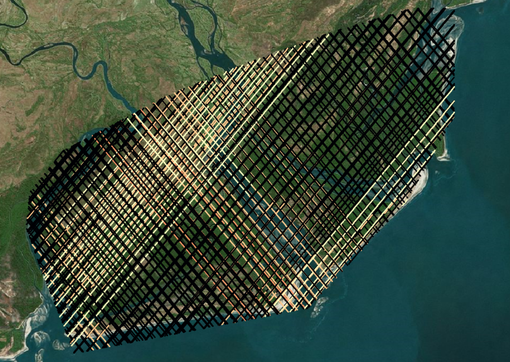
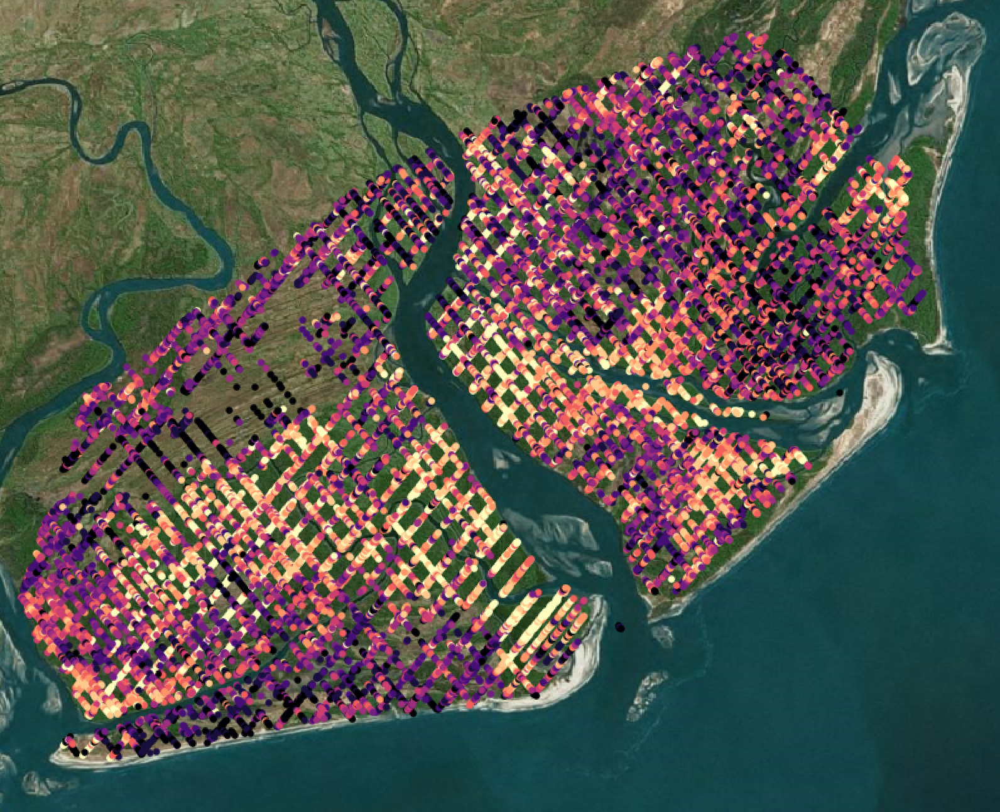
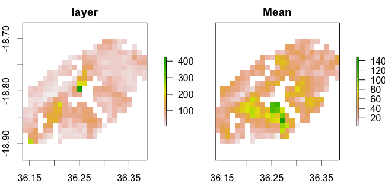

# GEDI L4A

## Load Packages and Functions

``` r
library(hdf5r)
library(data.table)
library(raster)
library(ggplot2)
library(rgdal)
source("R/GEDI_FUN.R")
```

## Get your list of GEDI L4A Data

``` r
#get a list of GEDI L4A files
L4A.ls<-list.files("Data/GEDIL4A", pattern="h5",
                   recursive = TRUE, full.names = TRUE)
```

## GEDI L4A data structure

First, let's take a look

``` r
print(L4A.ls[1:4])
```

```         
[1] "Data/GEDIL4A/GEDI04_A_2019116121457_O02091_04_T00476_02_002_02_V002_subsetted.h5"
[2] "Data/GEDIL4A/GEDI04_A_2019123093221_O02198_04_T03016_02_002_02_V002_subsetted.h5"
[3] "Data/GEDIL4A/GEDI04_A_2019158192850_O02748_04_T01746_02_002_02_V002_subsetted.h5"
[4] "Data/GEDIL4A/GEDI04_A_2019174002232_O02984_01_T02212_02_002_02_V002_subsetted.h5"
```

For an example of the GEDI data structure I'm going to choose a single orbit within our AOI:

``` r
#Pick one!
gedi.file<-L4A.ls[1]

#read in the GEDI L4A file
L4A.h5<-readLevel4B(gedi.file)
```

`readLevel4A` simply reads in the h5 GEDI file. Nothing mysterious!

Now that we have a GEDI L4A data in R we can look at the structure. It has a very complex hierarchical structure:

``` r
#Let's look at a subset of the GEDI data structure
list.datasets(L4A.h5[["BEAM0000"]])
```

```         
   [1] "lon_lowestmode"                            "predict_stratum"                          
  [3] "beam"                                      "agbd_pi_lower"                            
  [5] "selected_mode_flag"                        "agbd_pi_upper"                            
  [7] "selected_algorithm"                        "xvar"                                     
  [9] "predictor_limit_flag"                      "agbd"                                     
 [11] "sensitivity"                               "elev_lowestmode"                          
 [13] "response_limit_flag"                       "agbd_prediction/agbd_se_a2"               
 [15] "agbd_prediction/l2_quality_flag_a4"        "agbd_prediction/agbd_a3"                  
 [17] "agbd_prediction/agbd_se_a3"                "agbd_prediction/agbd_se_a10"              
 [19] "agbd_prediction/selected_mode_a10"         "agbd_prediction/agbd_pi_lower_a3"         
 [21] "agbd_prediction/selected_mode_flag_a10"    "agbd_prediction/selected_mode_a2"         
 [23] "agbd_prediction/agbd_t_pi_lower_a2"        "agbd_prediction/agbd_t_pi_upper_a3"       
 [25] "agbd_prediction/predictor_limit_flag_a1"   "agbd_prediction/agbd_pi_upper_a1"         
 [27] "agbd_prediction/l4_quality_flag_a1"        "agbd_prediction/algorithm_run_flag_a5"    
 [29] "agbd_prediction/selected_mode_a4"          "agbd_prediction/agbd_a2"                  
 [31] "agbd_prediction/l4_quality_flag_a4"        "agbd_prediction/algorithm_run_flag_a3"    
 [33] "agbd_prediction/l4_quality_flag_a6"        "agbd_prediction/xvar_a1"                  
 [35] "agbd_prediction/predictor_limit_flag_a2"   "agbd_prediction/xvar_a5"                  
 [37] "agbd_prediction/selected_mode_a6"          "agbd_prediction/agbd_t_pi_lower_a6"       
 [39] "agbd_prediction/predictor_limit_flag_a5"   "agbd_prediction/agbd_pi_upper_a4"         
 [41] "agbd_prediction/predictor_limit_flag_a4"   "agbd_prediction/agbd_pi_upper_a2"         
 [43] "agbd_prediction/l4_quality_flag_a10"       "agbd_prediction/agbd_t_pi_lower_a3"       
 [45] "agbd_prediction/agbd_a5"                   "agbd_prediction/l2_quality_flag_a3"       
 [47] "agbd_prediction/selected_mode_flag_a5"     "agbd_prediction/agbd_t_se_a5"             
 [49] "agbd_prediction/xvar_a6"                   "agbd_prediction/selected_mode_flag_a3"    
 [51] "agbd_prediction/xvar_a4"                   "agbd_prediction/agbd_pi_lower_a4"         
 [53] "agbd_prediction/l2_quality_flag_a2"        "agbd_prediction/algorithm_run_flag_a1"    
 [55] "agbd_prediction/agbd_a4"                   "agbd_prediction/agbd_t_se_a4"             
 [57] "agbd_prediction/algorithm_run_flag_a2"     "agbd_prediction/response_limit_flag_a6"   
 [59] "agbd_prediction/agbd_t_a3"                 "agbd_prediction/agbd_t_pi_lower_a10"      
 [61] "agbd_prediction/xvar_a3"                   "agbd_prediction/agbd_pi_lower_a2"         
 [63] "agbd_prediction/response_limit_flag_a4"    "agbd_prediction/response_limit_flag_a1"   
 [65] "agbd_prediction/l2_quality_flag_a6"        "agbd_prediction/selected_mode_a5"         
 [67] "agbd_prediction/agbd_t_pi_lower_a5"        "agbd_prediction/l2_quality_flag_a10"      
 [69] "agbd_prediction/agbd_t_pi_upper_a4"        "agbd_prediction/agbd_t_se_a10"            
 [71] "agbd_prediction/xvar_a10"                  "agbd_prediction/predictor_limit_flag_a6"  
 [73] "agbd_prediction/l4_quality_flag_a3"        "agbd_prediction/agbd_t_pi_upper_a6"       
 [75] "agbd_prediction/agbd_a10"                  "agbd_prediction/agbd_pi_upper_a3"         
 [77] "agbd_prediction/agbd_pi_lower_a6"          "agbd_prediction/agbd_t_a1"                
 [79] "agbd_prediction/shot_number"               "agbd_prediction/agbd_t_pi_lower_a4"       
 [81] "agbd_prediction/selected_mode_flag_a1"     "agbd_prediction/algorithm_run_flag_a10"   
 [83] "agbd_prediction/agbd_pi_lower_a10"         "agbd_prediction/agbd_pi_upper_a10"        
 [85] "agbd_prediction/l2_quality_flag_a1"        "agbd_prediction/agbd_pi_upper_a6"         
 [87] "agbd_prediction/selected_mode_a3"          "agbd_prediction/selected_mode_flag_a2"    
 [89] "agbd_prediction/l2_quality_flag_a5"        "agbd_prediction/predictor_limit_flag_a3"  
 [91] "agbd_prediction/selected_mode_flag_a4"     "agbd_prediction/agbd_se_a1"               
 [93] "agbd_prediction/response_limit_flag_a5"    "agbd_prediction/l4_quality_flag_a2"       
 [95] "agbd_prediction/selected_mode_a1"          "agbd_prediction/agbd_a6"                  
 [97] "agbd_prediction/response_limit_flag_a3"    "agbd_prediction/selected_mode_flag_a6"    
 [99] "agbd_prediction/agbd_a1"                   "agbd_prediction/agbd_t_a2"                
[101] "agbd_prediction/xvar_a2"                   "agbd_prediction/agbd_se_a5"               
[103] "agbd_prediction/agbd_pi_lower_a1"          "agbd_prediction/response_limit_flag_a2"   
[105] "agbd_prediction/agbd_t_a5"                 "agbd_prediction/agbd_t_pi_upper_a10"      
[107] "agbd_prediction/agbd_t_a10"                "agbd_prediction/algorithm_run_flag_a4"    
[109] "agbd_prediction/agbd_t_pi_upper_a5"        "agbd_prediction/algorithm_run_flag_a6"    
[111] "agbd_prediction/agbd_t_pi_upper_a2"        "agbd_prediction/agbd_t_se_a6"             
[113] "agbd_prediction/agbd_t_a6"                 "agbd_prediction/agbd_se_a4"               
[115] "agbd_prediction/l4_quality_flag_a5"        "agbd_prediction/agbd_t_se_a3"             
[117] "agbd_prediction/agbd_t_se_a2"              "agbd_prediction/agbd_se_a6"               
[119] "agbd_prediction/agbd_t_pi_upper_a1"        "agbd_prediction/agbd_t_pi_lower_a1"       
[121] "agbd_prediction/agbd_pi_upper_a5"          "agbd_prediction/agbd_t_a4"                
[123] "agbd_prediction/predictor_limit_flag_a10"  "agbd_prediction/agbd_pi_lower_a5"         
[125] "agbd_prediction/response_limit_flag_a10"   "agbd_prediction/agbd_t_se_a1"             
[127] "degrade_flag"                              "selected_mode"                            
[129] "lat_lowestmode"                            "algorithm_run_flag"                       
[131] "shot_number"                               "l4_quality_flag"                          
[133] "channel"                                   "agbd_t_se"                                
[135] "land_cover_data/urban_proportion"          "land_cover_data/pft_class"                
[137] "land_cover_data/leaf_on_doy"               "land_cover_data/leaf_off_flag"            
[139] "land_cover_data/leaf_off_doy"              "land_cover_data/urban_focal_window_size"  
[141] "land_cover_data/landsat_treecover"         "land_cover_data/shot_number"              
[143] "land_cover_data/region_class"              "land_cover_data/landsat_water_persistence"
[145] "land_cover_data/leaf_on_cycle"             "solar_elevation"                          
[147] "delta_time"                                "agbd_t"                                   
[149] "agbd_se"                                   "surface_flag"                             
[151] "geolocation/lat_lowestmode_a3"             "geolocation/lon_lowestmode_a10"           
[153] "geolocation/lat_lowestmode_a6"             "geolocation/lon_lowestmode_a4"            
[155] "geolocation/sensitivity_a2"                "geolocation/elev_lowestmode_a6"           
[157] "geolocation/lon_lowestmode_a1"             "geolocation/sensitivity_a10"              
[159] "geolocation/sensitivity_a4"                "geolocation/lon_lowestmode_a5"            
[161] "geolocation/elev_lowestmode_a3"            "geolocation/elev_lowestmode_a5"           
[163] "geolocation/shot_number"                   "geolocation/elev_lowestmode_a2"           
[165] "geolocation/elev_lowestmode_a10"           "geolocation/stale_return_flag"            
[167] "geolocation/lon_lowestmode_a6"             "geolocation/sensitivity_a5"               
[169] "geolocation/lat_lowestmode_a10"            "geolocation/sensitivity_a1"               
[171] "geolocation/lat_lowestmode_a4"             "geolocation/sensitivity_a3"               
[173] "geolocation/elev_lowestmode_a4"            "geolocation/lon_lowestmode_a2"            
[175] "geolocation/sensitivity_a6"                "geolocation/lat_lowestmode_a2"            
[177] "geolocation/lon_lowestmode_a3"             "geolocation/lat_lowestmode_a1"            
[179] "geolocation/lat_lowestmode_a5"             "geolocation/elev_lowestmode_a1"           
[181] "master_int"                                "l2_quality_flag"                          
[183] "master_frac"    
```

**WOW!** That is a lot of info to grab (183 variables X 8 beams!). So you need to choose what is important to you for processing.

Now, within each beam we can subset by the specific data we need.

# Read in ALL of our GEDI data

## Getting the L4A Data

Let's look at the function to extract a simple dataframe from the GEDI h5 file.

``` r
L4A.m<-getLevel4A(L4A.h5)
```

`getLevel4A` selects useful metrics for further processing. The code for `getLevel4A` is based on the rGEDI package function, but is updated to function in the recent version of R. This greatly simplifies the pipeline. We can modify this function to include specific information from the h5 file, but, by default it includes:

"beam",
 "shot_number",
 "lon_lowestmode",
 "lat_lowestmode",
 "delta_time",
 "sensitivity",
 "solar_elevation",
 "selected_algorithm",
 "elev_lowestmode",
 "agbd_pi_lower",
 "agbd_pi_upper",
 "agbd",
 "agbd_se",
 "agbd_t",
 "agbd_t_se",
 "l2_quality_flag" ,
 "degrade_flag" ,
 "l4_quality_flag"

I find these variables give me most of what I need from the L4A data product.

## Process using lapply

Now we can use `lapply` to process our list of GEDI L4A data

``` r
#we use a lapply function to do this as it can easily be made parallel
L4A.ls.all<-lapply(L4A.ls, function(x){
  L4A.m<-NULL
  L4A.h5<-readLevel4A(x)
  try(L4A.m<-getLevel4A(L4A.h5), silent = TRUE)
  return(L4A.m)
})

#combine the list into a single long data frame with the rbind command
L4A.all<-do.call(rbind,L4A.ls.all)
```

We can now take a look at all of our GEDI data.

## Clipping to our AOI

We will now import our polygon extent, extract data within our AOI, and write to file:

``` r
#Make a spatial object from the DF for subsetting and extraction. Don't forget the CRS!
L4A.sp<-SpatialPointsDataFrame(coords=cbind(L4A.all$lon_lowestmode,L4A.all$lat_lowestmode),
                               data=L4A.all,
                               proj4string = crs(raster()))
#we bring in our extent polygon and use it for subsetting.
extent.poly<-rgdal::readOGR("Data/extent/Zambezi_poly.shp")

#Why do we use extract? The clip function will not accept geometry, 
# so the square extent is the only thing it will clip to. If you want to use 
# complex geometry, use this method.
ext.ex<-extract(extent.poly, L4A.sp)

#add extracted values to the GEDI data
L4A.sp@data$ext.flag<-ext.ex[,2]

#now subset by the identified extent flag
L4A.sp<-L4A.sp[!is.na(L4A.sp$ext.flag),]

#we also need to convert the shot number column to an integer for writing purposes
L4A.sp$shot_number<-as.numeric(L4A.sp$shot_number)

#write the file!
writeOGR(L4A.sp, "output/GEDI_L4A.shp", layer='shot_number', driver="ESRI Shapefile")
```

Let's take a look at these data in QGIS (colored by degrade flag):



All black values are potentially poor quality, so let's filter by the quality flags and see what we get.

``` r
#now let's subset based on our observations
L4A.q1.sp<-L4A.sp[L4A.sp$degrade_flag==0&
                    L4A.sp$l2_quality_flag==1&
                    L4A.sp$l4_quality_flag==1,]

#write the file!
writeOGR(L4A.q1.sp, "GEDI_L4A_high_quality.shp", layer='shot_number', driver="ESRI Shapefile")
```



With this we can see the distribution of values for aboveground biomass density (AGBD).

## Developing AGB Maps

Now that we have our high quality AGBD data we can create a raster grid of a coarse (0.01 degree or \~1.11 km) to create continuous maps of PAVD at specific heights.

``` r
#create a raster of 0.01 degree resolution to grid the L4A data
r<-raster::raster(ext = extent(L4A.q1.sp), resolution = 0.01)
```

Next we need to rasterize the GEDI point data, estimating the average (and standard deviation if you like) of AGB for each pixel. We will take the `agbd` variable and calculate the mean and standard deviation of all GEDI AGBD shots per pixel.

``` r
agb.r<-rasterize(L4A.q1.sp, r, fun=function(x, na.rm=TRUE) mean(x), field='agbd')
agb.sd.r<-rasterize(L4A.q1.sp, r, fun=function(x, na.rm=TRUE) sd(x), field='agbd')
```

We now build a raster stack from our rasters, rename them, and plot our work!

``` r
agb.s<-stack(agb.r,agb.sd.r)
names(agb.s)<-c("agb","agb_sd")
plot(agb.s)
```


## Comparing to the Global GEDI L4B AGB map

Now we can import the global GEDI L4B gridded L4B data and directly compare to the map we just made.

``` r
# import GEDI global AGB map
gedi.agb.global<-raster("Data/GEDIL4B/GEDI04_B_MW019MW138_02_002_05_R01000M_MU_clipped.tif")

# reproject the GEDI map to our coordinate system
gedi.agb.global.t<-projectRaster(gedi.agb.global, r)

# now we rasterize to the same grid as the global GEDI data
agb.r<-rasterize(L4A.q1.sp, gedi.agb.global, fun=function(x, na.rm=TRUE) mean(x), field='agbd')

# exclude invalid cells 
gedi.agb.global[is.na(agb.r)]<-NA
agb.r[is.na(gedi.agb.global)]<-NA

#lets see the two beside eachother!
plot(stack(agb.r,gedi.agb.global))
```



## 
